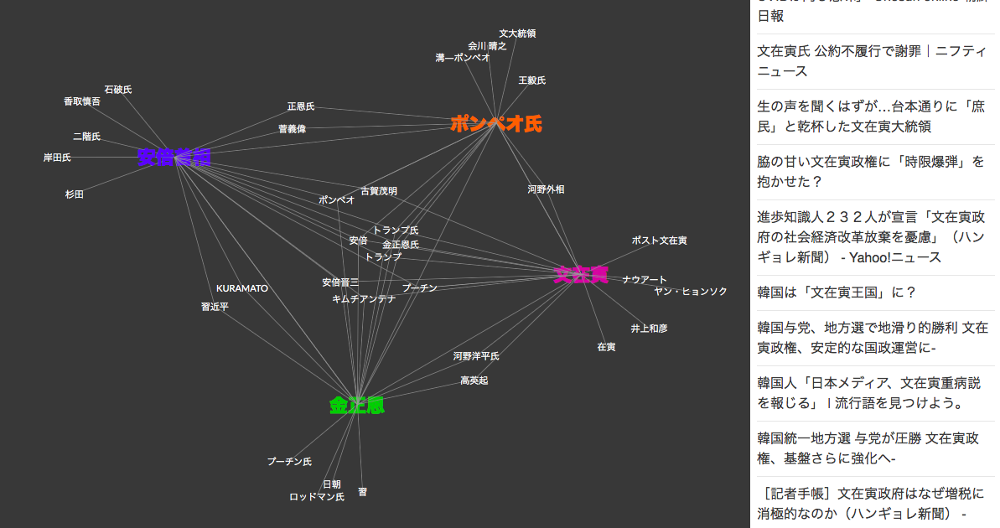

# Discovery News サンプルアプリ (人間関係) 日本語版
Watson Discovery Newsは、情報検索・探索用APIであるWatson Discovery上にIBMが自ら世界中のニュースを収集し、情報サービスとして提供しているものです。  

このアプリケーションはWatson Discovery Newsの機能を簡単に確認するためのものです。  
ニュース記事の中から検索のキーとなっている人物を含むものを選択し、この中に出ている他の人物の名称を集計します。    
その人物名を元の人物の周りに配置して、その根拠となった記事一覧を右側の欄に表示します。
新しく出てきた人物を表すノードをクリックすると、その人物を検索キーに同じ処理を行い、新たな人物関係を画面上に表記します。  
右側のリストは元記事へのリンクとなっていて、クリックすると元記事を参照できます。  


デモ画面  


## 事前準備
* IBM Cloudのアカウントを取得していることが前提です。
* また、作業するPCの以下のCLIツールが導入されていることが前提です。

  - [Cloud Foundryコマンドラインツール](https://github.com/cloudfoundry/cli#downloads)
  - [gitコマンドラインツール](https://git-scm.com/downloads) (注:gitコマンドを使用する場合)

## ソースのダウンロード
* Githubからアプリケーションのソースをダウンロードします。
* ``git clone``コマンドを実行するか、[Githubリンク](https://github.com/sougou-enshu1/discovery-news-relation.git)からzipファイルのダウンロードを行います。  
* ダウンロード後、できたサブディレクトリにcdします。

## セットアップ
* Watson Discovery サービスの作成、認証情報の確認  
IBM Cloudにログインし、
既に既存のWatson Discoveryサービスがある場合には該当のサービスの認証情報を確認します。
ない場合には新規に作成し、認証情報を確認します。
* 認証情報の確認  
IBM CloudダッシュボードからDiscoveryサービスの管理画面を開き、APIキー / URLを確認します。
* local.envファイルの設定
次のコマンドでlocal.envファイルの雛形からlocal.envをコピーし、確認したAPIキー / URLをセットし、保存します。

```
$ cp local.env.sample local.env
```

```
DISCOVERY_IAM_APIKEY=xxxxxxxxxx
DISCOVERY_IAM_URL=xxxxxxxxxx
```

## CFコマンドでログイン
* PCのターミナルやコマンドプロンプトから、cfコマンドでIBM Cloud環境にログインします。ログイン名、パスワードはIBM Cloudアカウント登録で登録したものを利用します。
* ユーサーidやパスワードを入力してログインします。このとき、アプリケーションを展開するアカウント、組織、スペースを選択してください。

```
$ cf api https://api.ng.bluemix.net
$ cf login
```

## アプリケーションのデプロイ
次のコマンドを実行します。
\<service_name\>はなんでもいいのですが、インターネット上のURLの一部となるので、ユニークな名前を指定します。  
(例) discovery-news-relations

```
$ cf push <service_name>
```

デプロイには数分かかります。デプロイが正常に完了したらアプリケーションを起動できます。  
次のURLをブラウザから指定して下さい。
\<person_name\>は、最初の検索条件とする人物名です。例のようにブランクを含んでいても大丈夫です。
(ブラウザがエンコーディングをやってくれます)

```
https://<service_name>.mybluemix.net/<preson_name>
```

(例) https://<service_name>.mybluemix.net/安倍首相


## 参考リンク

- [Cloud_foundry](https://github.com/cloudfoundry/cli#downloads)
- [git](https://git-scm.com/downloads)
- [IBM Clouod サインアップ](https://bluemix.net/registration)
